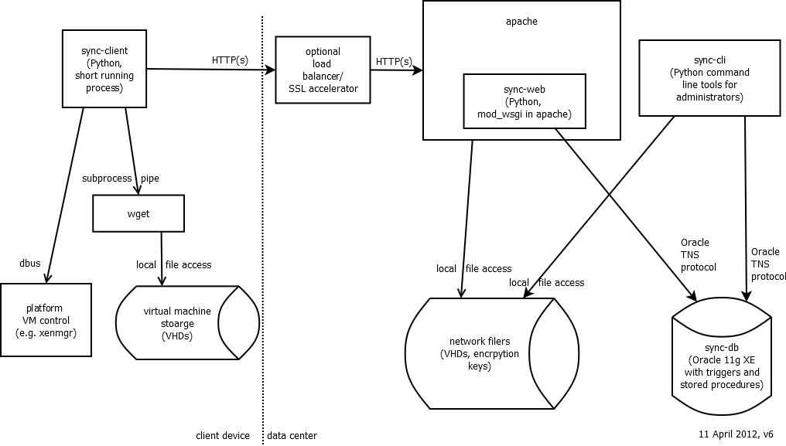

The OpenXT synchronizers

Synchronizer XT enables sysadmins and IT professionals to securely and
easily manage a large number of XenClient laptops and the Windows VMs
that run on them.

This contains the client part of the OpenXT synchronizer. The code here (mainly 
sync_client/client.py) is a python program that runs in a low privilege service VM,
makes an HTTPS to a synchronizer web server which tells it what VMs it should be running.
client.py then compares this to the current state of the machine, downloads disks, configures
and starts VM as appropriate.

Note that client.py is a short running process which maintains no state. It runs once
to completion and then exits. Normally client.py is started by launcher.py which handles
getting the configuring information for client.py and running it regularly, and handling exits.

## Dependencies

sync-client requires:

* a synchronizer server to get target state and VHDs from (see https://github.com/openxt/sync-server/). In
turn the synchronizer server will require:
** sync-database, a schema and stored procedures
** sync-cli, commnad line tools to access that database
** sync-wui, an optional web user interface for administrators
* icbinn (https://github.com/openxt/icbinn) to provide specific filesystem access to dom0 to write VHD files
* Python 2, (http://python.org)
* dbus-python (https://pypi.python.org/pypi/pydbus/0.2) 

Normally sync-client is built as part of an OpenXT build via the recipe (OpenEmbedded makefile) at:

  https://github.com/OpenXT/xenclient-oe/blob/master/recipes-openxt/xenclient/sync-client_git.bb

## Getting help

Start at:

  http://www.openxt.org/

for details of reaching the OpenXT community.

## Authors

This document was written by Dickon Reed, dickon@cantab.net, 20th
February 2015. 

The OpenXT synchronizer was written by a wider team, who may wish to add
themselves to this README file.

